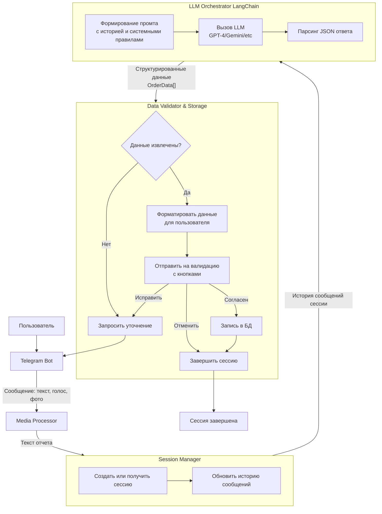

# Рекомендации по сценарию взаимодействия с пользователем

### Архитектурное Решение

**Высокоуровневая архитектура** будет состоять из следующих компонентов:

1.  **Telegram Bot**: endpoint для получения сообщений (текст, голос, фото).
2.  **Media Processor**: модуль для конвертации голоса (Whisper/Speech-to-Text) и фото (Tesseract/OCR) в текст.
3.  **Session Manager**: ядро, управляющее состоянием диалога с пользователем.
4.  **LLM Orchestrator** (на LangChain): модуль для взаимодействия с LLM (например, GPT-4), включая промт-инжиниринг и парсинг ответа.
5.  **Data Validator & Storage**: модуль для финальной валидации, взаимодействия с пользователем и записи в БД.

Вот как эти компоненты взаимодействуют друг с другом:



---

### Детализация Сценария (Step-by-Step)

**1. Начало сессии:**
Пользователь отправляет боту сообщение: текст, голосовое сообщение или фото.
*   **Голос/Фото:** `Media Processor` конвертирует в текст используя STT (например, OpenAI Whisper) и OCR (например, Tesseract) соответственно.
*   Бот создает новую сессию с уникальным `session_id` (например, `user_id + timestamp`). Все последующие сообщения пользователя в рамках этого диалога будут привязаны к этой сессии.

**2. Обработка текста LLM:**
Текст отчета и история предыдущих сообщений в сессии отправляются в LLM через `LLM Orchestrator`.

**3. Валидация и уточнение:**
*   LLM возвращает структурированные данные. Бот форматирует их в читаемый вид и отправляет пользователю.
*   **Пример сообщения для валидации:**
    > **Проверьте, пожалуйста, данные:**
    > *   **Заказ #10409:** Статус `В доработку`. Комментарий: `Отверстия М3 не все проходят с обеих сторон. Продувка не помогла.`
    > *   **Заказ #10494:** Статус `Годно`.
    >
    > Всё верно?
*   **Кнопки:** `Согласен`, `Исправить`, `Отменить`.

**4. Действия пользователя:**
*   **`Согласен`:** Данные записываются в БД. Сессия завершается.
*   **`Исправить`:** Бот запрашивает уточнение ("Что именно нужно исправить?"). Новое сообщение пользователя добавляется в историю сессии и отправляется в LLM для обновления данных (шаг 2).
*   **`Отменить`:** Сессия завершается без записи в БД.

**5. Таймаут:** Если в течение N минут (например, 15) не было активность, сессия автоматически завершается.

---

### Реализация на LangChain (Python Backend)

#### 1. Модели данных (Pydantic)

```python
from pydantic import BaseModel, Field
from typing import List, Optional, Literal
from enum import Enum

class StatusEnum(str, Enum):
    approved = "годно"
    rework = "в доработку"
    reject = "в брак"

class OrderData(BaseModel):
    order_id: str = Field(description="Номер заказа, строка из 4-5 цифр, извлеченная из текста")
    status: Optional[StatusEnum] = Field(description="Статус проверки изделия")
    comment: Optional[str] = Field(description="Комментарий контролера к статусу")

class LLMResponse(BaseModel):
    orders: List[OrderData] = Field(description="Список распознанных заказов и их статусов")
    requires_correction: bool = Field(description="Флаг, что данные неполные и требуется уточнение у пользователя")
    clarification_question: Optional[str] = Field(description="Сформулированный вопрос пользователю для уточнения, если requires_correction=True")
```

#### 2. Промт и Цепочка (Chain)

**Системный промт** (`system_template`):

```python
system_template = """
Ты — ассистент, который структурирует текстовые отчеты контролеров ОТК о проверке деталей.
Твоя задача — извлечь из сырого текста информацию о номерах заказов, статусе проверки и комментариях.

# ВХОДНЫЕ ДАННЫЕ:
Ты получишь историю диалога с пользователем. Последнее сообщение от пользователя — это текущий отчет для обработки.

# ПРАВИЛА ОБРАБОТКИ:
1. Извлеки номера заказов. Номер заказа — это число из 4 или 5 цифр.
   - В текстовых сообщениях он может быть в виде "#с10409", "#10409", "10409".
   - В аудио-сообщениях номер часто связан со словом "строка" (например, "строка 10409").
   - В OCR-тексте может быть просто число и статус через дефис ("10432 - годно").
2. Определи статус для КАЖДОГО найденного заказа. Статус может быть: "годно", "в доработку", "в брак".
   - Синонимы для "годно": "норм", "все хорошо", "готово", "принято", "ок".
   - Синонимы для "в брак": "брак", "негоден", "на списание", "лом".
   - Синонимы для "в доработку": "доработка", "переделать", "исправить", "ремач".
3. Извлеки комментарий, объясняющий статус.
4. Если в тексте нет четкого статуса, но есть описание проблемы, установи статус "в доработку".
5. Если в тексте нет номеров заказов или статус неясен, ты ДОЛЖЕН установить флаг `requires_correction`=True и сформулировать четкий вопрос пользователю в `clarification_question`.
6. Если в тексте упоминается 2 или больше статусов по 1 заказу ( например "проверено 34 шт, из них 8 в доработку, 4 в брак, остальные годные"), то сформируй в ответе JSON блок по каждой группе со своим статусом и комментарием. В комментарии укажи количество изделий.
7. Отвечай ТОЛЬКО в формате JSON, используя схему, указанную ниже.

# ВАЖНО: Учитывай контекст всей сессии. Если пользователь присылает уточнение (например, "исправь статус для 10409 на годно"), обнови данные предыдущего отчета, а не создавай новый.

{format_instructions}
"""
```

**Цепочка с output parser:**

```python
from langchain.prompts import ChatPromptTemplate, HumanMessagePromptTemplate, SystemMessagePromptTemplate
from langchain.chat_models import ChatOpenAI # или ChatAnthropic
from langchain.output_parsers import PydanticOutputParser

parser = PydanticOutputParser(pydantic_object=LLMResponse)
format_instructions = parser.get_format_instructions()

prompt = ChatPromptTemplate(
    messages=[
        SystemMessagePromptTemplate.from_template(system_template),
        HumanMessagePromptTemplate.from_template("{user_input}")
    ],
    input_variables=["user_input"],
    partial_variables={"format_instructions": format_instructions}
)

# Цепочка: Промт -> Модель -> Парсер
llm = ChatOpenAI(model_name="gpt-4-turbo-preview", temperature=0)
structured_llm_chain = prompt | llm | parser
```

#### 3. Обработка ответа LLM

```python
def process_report_text(session_history: List[str]) -> LLMResponse:
    """
    Обрабатывает историю сообщений сессии через LLM.
    Возвращает структурированный ответ или флаг необходимости уточнения.
    """
    # Объединяем историю сессии в один текст или берем последнее сообщение с контекстом
    full_text = "\n".join(session_history)

    try:
        # Выполняем запрос к LLM
        llm_response: LLMResponse = structured_llm_chain.invoke({"user_input": full_text})
        return llm_response
    except Exception as e:
        # В случае ошибки парсинга или запроса, запрашиваем уточнение
        return LLMResponse(
            orders=[],
            requires_correction=True,
            clarification_question="Произошла ошибка при обработке. Пожалуйста, опишите отчет еще раз."
        )

# Где-то в обработчике сообщений бота (псевдокод):
session = get_user_session(user_id)
session.messages.append(user_message_text) # Добавляем новое сообщение в историю сессии

llm_data = process_report_text(session.messages)

if llm_data.requires_correction:
    # Отправляем вопрос пользователю из llm_data.clarification_question
    bot.send_message(chat_id, llm_data.clarification_question)
else:
    # Сохраняем llm_data.orders во временное хранилище сессии
    session.extracted_orders = llm_data.orders
    # Форматируем orders в красивый текст и отправляем на валидацию с кнопками
    validation_text = format_orders_for_confirmation(llm_data.orders)
    bot.send_message(chat_id, validation_text, reply_markup=validation_keyboard())
```

---

### Критические Замечания и Советы

1.  **Выбор LLM:** Используйте самые современные и мощные модели (GPT-4 Turbo, Claude 3), так как задача требует точного следования инструкциям и парсинга.
2.  **Безопасность:** Не доверяйте LLM на 100%. Всегда используйте второй контур валидации — подтверждение оператором.
3.  **Кастомизация:** Подготовьте промт на основе реальных примеров из вашей базы. Fine-tuning небольшой модели на своих данных может дать лучшие результаты по стоимости и скорости.
4.  **Мониторинг:** Логируйте все запросы/ответы LLM. Это поможет исправлять промт и обрабатывать edge-cases.
5.  **Производительность:** Кэшируйте ответы LLM для идентичных запросов в рамках сессии, чтобы избежать лишних вызовов.
6.  **Отказоустойчивость:** Всегда обрабатывайте исключения от LLM (например, сбой парсинга JSON) и имейте fallback-сценарий — запрос уточнения у пользователя.